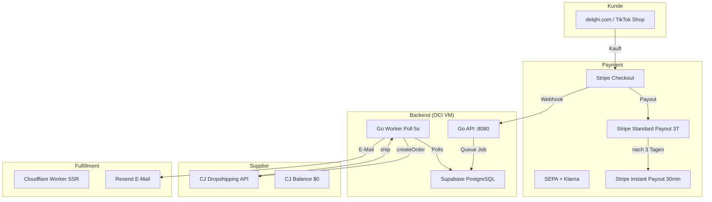
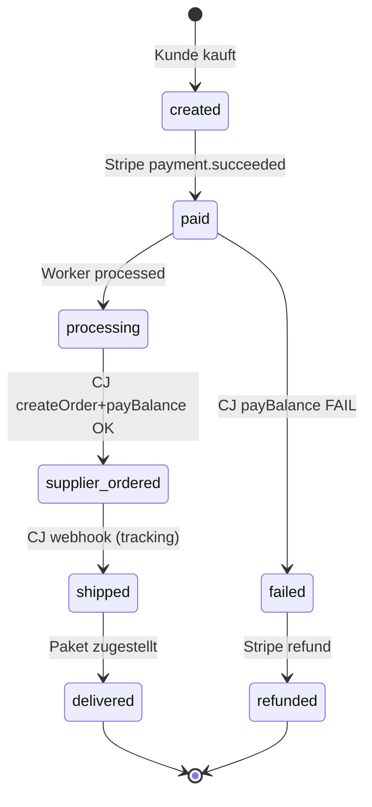
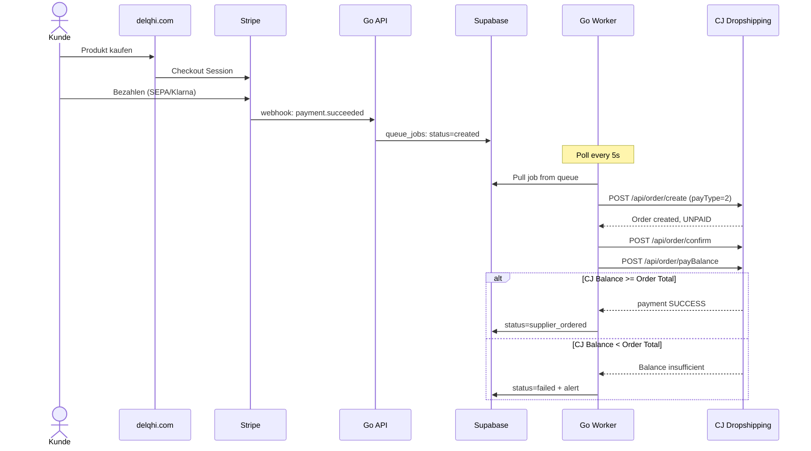
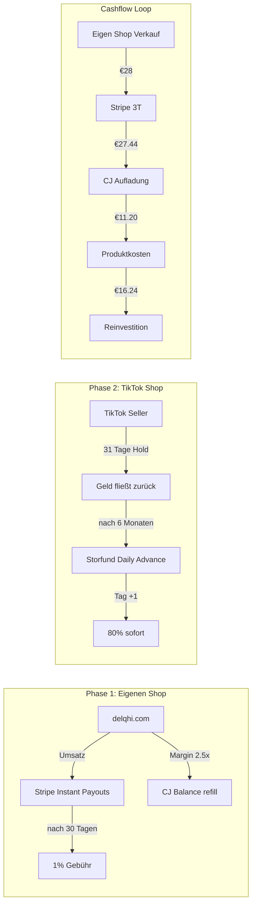
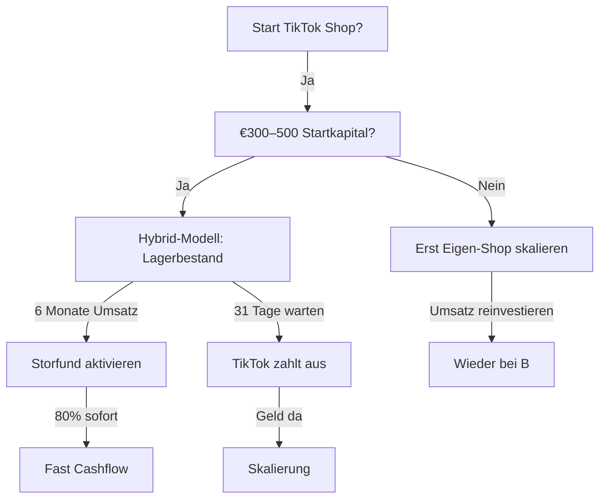

# Delqhi Shop Strategie 2026

## Executive Summary

**Ziel:** Vollautomatisierte Dropshipping-Maschine mit CJ Dropshipping als Lieferant, Stripe als Payment-Provider und parallelem TikTok Shop Wachstumskanal.

**Status:**
- Eigener Shop (delqhi.com): Online, Stripe Live, 2 CJ-Produkte
- TikTok Shop: Noch nicht gestartet
- Haupt-Blocker: CJ Balance = $0 (muss aufgeladen werden)

---

## Architektur-Übersicht



---

## Cashflow & Timeline

```mermaid
gantt
    title Parallel-Strategie Timeline
    dateFormat  YYYY-MM-DD
    axisFormat  %d.%m

    section Eigenen Shop
    CJ $30 aufladen           :done, cj1, 2026-05-27, 1d
    Testbestellung            :active, test, after cj1, 2d
    Instant Payouts prüfen    :active, ip, after test, 14d
    Resend Domain setup       :pending, res, 2026-06-01, 7d
    Mehr Produkte            :pending, prod, 2026-06-05, 14d

    section TikTok Shop
    Seller Account erstellen  :pending, tt1, 2026-05-28, 3d
    Produkte ins Lager        :pending, tt2, after tt1, 7d
    TikTok Shop live          :pending, tt3, after tt2, 3d
    Erste Verkäufe            :pending, tt4, after tt3, 14d
    31-Tage-Haltefrist        :pending, tt5, after tt4, 31d
    Storfund Daily Advance    :pending, tt6, after tt5, 14d
```

---

## Status-Maschine (Order Lifecycle)



---

## CJ 3-Step Auto-Pay Flow



---

## TikTok Shop Parallel-Strategie



---

## Kritische Pfade & Blocker

| Blocker | Status | Lösung | Priorität |
|---------|--------|--------|-----------|
| CJ Balance $0 | ❌ Blockiert alles | $30 per PayPal aufladen | 🔴 Kritisch |
| Stripe Instant Payouts | ⚠️ Noch nicht sichtbar | Nach erstem Verkauf ca. 14–30 Tage | 🟡 Mittel |
| Resend Domain | ⚠️ via resend.dev | Domain verify bei Resend + DNS | 🟡 Mittel |
| TikTok Seller Account | ❌ Nicht erstellt | Registrierung starten | 🟢 Niedrig |
| TikTok 31-Tage-Hold | ❌ Unvermeidlich | €300–500 Startkapital | 🟡 Mittel |

---

## Sofortige Action Items

1. **CJ Balance aufladen:** $30 via PayPal/Kreditkarte im CJ Dashboard
2. **Testbestellung:** Eigenes Produkt auf delqhi.com kaufen (Kreditkarte)
3. **TikTok registrieren:** [seller.tiktok.com](https://seller.tiktok.com) — Account erstellen
4. **Stripe Instant Payouts:** Täglich Dashboard prüfen ab Tag 1 nach erstem Verkauf
5. **Resend Domain:** [resend.com/domains](https://resend.com/domains) — delqhi.com hinzufügen

---

## Zahlen & Margen

| Produkttyp | VK Preis | CJ Kosten | Marge | Stripe Gebühr | Netto |
|------------|----------|-----------|-------|---------------|-------|
| Kleidung (€18) | €18.00 | €7.20 | 2.5x | €0.52 | €10.28 |
| Beauty (€28) | €28.00 | €11.20 | 2.5x | €0.81 | €15.99 |
| Instant Payout | — | — | — | 1.00% | — |
| Storfund (TikTok) | — | — | — | 0.1–0.2% | — |

**Break-even:** 1 Verkauf pro Tag = €300–450/Monat Netto nach allen Gebühren

---

## Entscheidungsbaum: TikTok Shop



---

*Letzte Aktualisierung: 2026-05-27*
*Projekt: SIN-Webshop-01 / delqhi.com*
