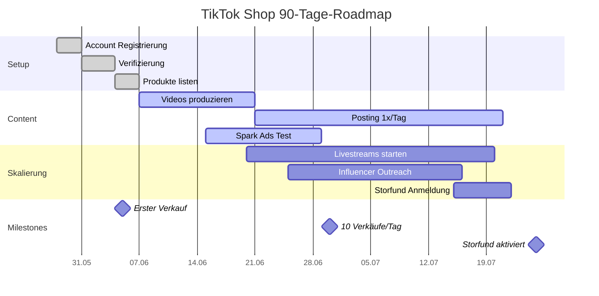

# TikTok Shop Business Plan — Delqhi (SIN-Webshop-01)

## 1. Executive Summary

**Geschäftsmodell:** Hybrid-Dropshipping auf TikTok Shop mit eigener Lagerhaltung für Top-Produkte.

**Warum TikTok Shop?**
- Algorithmus-basierte Viralität → exponentielles Wachstum möglich
- 1.5+ Milliarden aktive Nutzer weltweit
- Shop-funktion direkt in Videos integriert (Seamless Checkout)
- Niedrige CAC durch organische Reichweite

**Herausforderung:** TikTok hält Zahlungen für neue Seller 31 Tage ein (T+31).

---

## 2. Marktanalyse

### Zielgruppe

| Segment | Demografie | Interesse |
|---------|-----------|-----------|
| **Primary** | Frauen 18–34 | Beauty, Mode, Lifestyle |
| **Secondary** | Männer 18–29 | Gadgets, Fitness, Streetwear |
| **Tertiary** | Frauen 35–45 | Anti-Aging, Home & Living |

### Konkurrenz auf TikTok Shop (DE/EU)

| Anbieter | Stärke | Schwäche | Unsere Differenzierung |
|----------|--------|----------|----------------------|
| Shein | Preis, Auswahl | Qualität, Branding | Premium-Produkte mit Story |
| Temu | Extrem günstig | Lange Lieferzeit | Schneller Versand (CJ EU-Lager) |
| Amazon (Affiliates) | Trust | Kein TikTok Shop | Native Shopping Experience |

---

## 3. Produktstrategie

### Launch-Produkte (Phase 1 — Monat 1–2)

| Produkt | CJ PID | EK (CJ) | VK | Marge | TikTok Potenzial |
|---------|--------|---------|-----|-------|-----------------|
| EMS Microcurrent Face Massager | CJPF2725606 | $11.20 | €28 | 2.5x | 🔥🔥🔥 Viral (Beauty-Trend) |
| Batwing Sleeve Dress | CJLY2029697 | $7.20 | €18 | 2.5x | 🔥🔥 Mode/Seasonal |
| LED Face Mask (neu) | TBD | ~$15 | €35 | 2.3x | 🔥🔥🔥 Beauty-Trend |
| Compression Leggings | TBD | ~$8 | €22 | 2.75x | 🔥🔥 Fitness |

### Content-Strategie

**Video-Format für Viralität:**
```
Hook (0–2s):   "Dieses Gadget hat meine Haut in 2 Wochen verändert"
Problem (3–10s): "Ich hatte immer müde Augen..."
Lösung (11–25s): Produkt in Aktion zeigen
CTA (26–30s):   "Link im Shop — limitiert verfügbar"
```

**Posting-Frequenz:**
- Woche 1–2: 1 Video/Tag (Testphase)
- Woche 3–4: 2–3 Videos/Tag (Skalierung)
- Monat 2+: 3–5 Videos/Tag + Livestreams 2x/Woche

---

## 4. Finanzplan

### Startkapital-Bedarf

| Posten | Betrag | Kommentar |
|--------|--------|-----------|
| Erste Lagerbestände (CJ) | €200 | 10–20 Stück Top-Produkte |
| TikTok Ads (optional) | €150 | Spark Ads für erste Videos |
| Verpackung/Labels | €50 | Branded Packaging |
| Puffer für 31-Tage-Hold | €300 | Notfall-Cashflow |
| **Gesamt** | **€700** | Einmaliger Start |

### Cashflow-Projektion (TikTok Shop)

```mermaid
graph LR
    A[Monat 1: 5 Verkäufe/Tag] -->|€140/Tag| B[€4.200/Monat Brutto]
    B -->|31 Tage Hold| C[Monat 2: €0 aus TikTok]
    C -->|Monat 3| D[€4.200 aus Monat 1]
    D -->|+ Neuer Umsatz| E[€8.400/Monat]
    E -->|Monat 4| F[€12.600/Monat]
    F -->|Storfund Daily Advance| G[80% sofort = €10.080]
```



### Monatliche Kosten (ab Monat 2)

| Kostenart | Betrag |
|-----------|--------|
| TikTok Shop Gebühr | 5–15% je Kategorie |
| Verpackung/Versand | €2–3 pro Paket |
| Lager-Nachschub (CJ) | €200–500 |
| TikTok Ads (optional) | €0–300 |

---

## 5. Operativer Plan

### Phase 1: Setup (Woche 1–2)

| Tag | Aufgabe | Verantwortlich |
|-----|---------|----------------|
| 1 | TikTok Seller Account registrieren | Jeremy |
| 2 | Business-Verifizierung hochladen | Simone |
| 3 | Bankkonto (Trade Republic) verknüpfen | Simone |
| 4–5 | Erste 3 Produkte bei TikTok listen | Jeremy |
| 6–7 | Lagerbestände von CJ bestellen | Jeremy |
| 8–10 | Produktfotos/Videos drehen | Simone |
| 11–14 | Content-Kalender erstellen, 5 Videos produzieren | Simone |

### Phase 2: Launch (Woche 3–4)

| Tag | Aufgabe |
|-----|---------|
| 15 | TikTok Shop live schalten |
| 16–20 | 1 Video/Tag posten, Performance tracken |
| 21–25 | Best-performende Videos mit Spark Ads boosten |
| 26–30 | Affiliate-Programm aktivieren (Creator einladen) |

### Phase 3: Skalierung (Monat 2–3)

| Monat | Ziel | Maßnahme |
|-------|------|----------|
| 2 | 10 Verkäufe/Tag | Content erhöhen, Livestreams starten |
| 3 | 20 Verkäufe/Tag | Influencer-Partnerschaften, EU-Expansion |
| 4–6 | 50+ Verkäufe/Tag | Storfund Daily Advance beantragen, Automatisierung |

---

## 6. Risiken & Mitigation

| Risiko | Wahrscheinlichkeit | Impact | Mitigation |
|--------|-------------------|--------|------------|
| TikTok Account gesperrt | Mittel | Kritisch | Terms of Service strikt einhalten, keine Fake-Reviews |
| 31-Tage-Hold überlebt Cashflow | Hoch | Hoch | €700 Startkapital, Kreditkarte als Backup |
| Produktqualität schlecht | Mittel | Mittel | Vorab-Samples von CJ bestellen |
| Lieferzeit zu lang | Mittel | Mittel | Nur CJ-Produkte mit EU-Lager wählen |
| Konkurrenz kopiert | Hoch | Niedrig | Starker Brand-Content, Community aufbauen |

---

## 7. KPIs & Tracking

### Wöchentliche KPIs

| KPI | Ziel Woche 1 | Ziel Woche 4 | Ziel Monat 3 |
|-----|-------------|-------------|-------------|
| Videos gepostet | 7 | 28 | 90+ |
| Video Views (gesamt) | 1.000 | 50.000 | 500.000 |
| Follower | 0 | 500 | 5.000 |
| Verkäufe/Tag | 0 | 2 | 20 |
| Conversion Rate | — | 1% | 2% |
| Durchschnittlicher Bestellwert | — | €22 | €25 |
| Retourenquote | — | <5% | <3% |

### Tools

- **TikTok Shop Analytics:** Internes Dashboard
- **TikTok Analytics:** Creator Tools
- **Google Analytics 4:** Traffic-Tracking
- **Notion/Airtable:** Content-Kalender
- **CJ Dropshipping Dashboard:** Bestelltracking

---

## 8. Rechtliches

| Thema | Status | Maßnahme |
|-------|--------|----------|
| Impressum | ✅ | Hochgeladen auf delqhi.com, auch für TikTok Bio |
| AGB | ✅ | Vorhanden |
| Datenschutz | ✅ | Vorhanden |
| Widerrufsrecht | ✅ | Vorhanden |
| EORI-Nummer | ⚠️ | Für EU-Zoll bei Lager-Import — prüfen |
| USt-ID | ⚠️ | Falls Umsatz >€22.000/Jahr — beantragen |

---

## 9. 90-Tage-Roadmap



---

## 10. Zusammenfassung

**TikTok Shop ist unser Wachstumskanal für 2026.**

**Kritische Erfolgsfaktoren:**
1. ✅ Startkapital €700 bereitstellen (für 31-Tage-Hold)
2. ✅ Täglicher Content (mindestens 1 Video/Tag)
3. ✅ Qualitätskontrolle: CJ-Samples vor Lager-Import
4. ✅ Geduld: Erste 31 Tage sind Cashflow-negativ
5. ✅ Nach 6 Monaten: Storfund Daily Advance für sofortige Auszahlungen

**Expected ROI:**
- Monat 1–2: -€700 (Investition)
- Monat 3: Break-even
- Monat 6: €3.000–5.000/Monat Netto
- Monat 12: €10.000+/Monat Netto (mit Storfund + Skalierung)

---

*Business Plan erstellt: 2026-05-27*
*Eigentümer: Simone Schulze / Jeremy*
*Projekt: SIN-Webshop-01 / delqhi.com*
